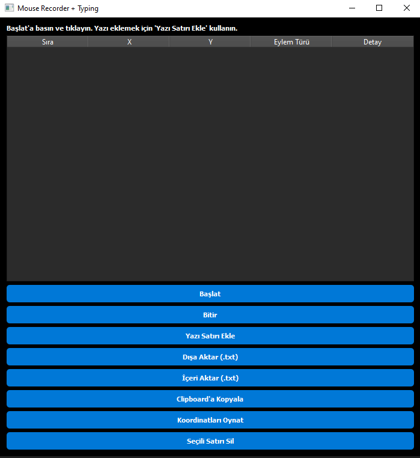

Genel Bakış:
--------------
MouseRecorder, masaüstünde mouse tıklama koordinatlarını kaydetmenizi, tabloya eklemenizi, seçili koordinatları silmenizi,
dışa aktarmanızı ve otomatik olarak oynatmanızı sağlayan kullanımı kolay bir Python uygulamasıdır.

Program Görseli :
----------------------------------

Bu araç özellikle:
- Tekrarlayan mouse hareketleri yapan kullanıcılar
- Test otomasyonu yapan yazılımcılar
- Sunum veya eğitim amaçlı mouse hareketlerini kaydetmek isteyenler
- Herkesin işini kolaylaştıracak hızlı bir mouse kayıt ve oynatma aracı arayanlar
için geliştirilmiştir.

Özellikler:
-------------
- Mouse tıklamalarını gerçek zamanlı olarak kaydetme
- Koordinatları tabloya ekleme ve sıralama
- Seçili koordinatları tablo üzerinden silme
- Tüm koordinatları .txt dosyasına dışa aktarma
- Clipboard’a kopyalama
- Kaydedilen koordinatları otomatik olarak oynatma (mouse hareketi + tıklama)
- Dark Metro temalı kullanıcı arayüzü

Neden Kullanmalı:
------------------
Bu araç, manuel olarak yaptığınız tekrarlayan tıklama işlerini otomatikleştirerek zaman kazandırır.
Herhangi bir program veya web uygulamasında mouse ile yapılan işlemleri hızlıca kaydedip tekrar oynatabilirsiniz.
Herkesin kullanabileceği, iş ve kişisel ihtiyaçlarda zaman kazandıran bir araçtır.

Kurulum:
---------
1. Repo klonlanır:
   git clone https://github.com/ebubekirbastama/ebs-MouseRecorder.git
   cd ebs-MouseRecorder

2. Gerekli kütüphaneler yüklenir:
   pip install -r requirements.txt

3. Uygulama çalıştırılır:
   python ebubekirbastama_mouse_recorder.py

Kullanım:
---------
1. Başlat butonuna tıklayın ve mouse ile tıklamalar yapın.
2. Tıklanan koordinatlar tabloya eklenecek.
3. İstersen Seçili Satırı Sil ile yanlış koordinatları kaldırabilirsiniz.
4. Dışa Aktar veya Clipboard’a Kopyala ile koordinatları kaydedebilirsiniz.
5. Koordinatları Oynat ile kaydedilen noktalar mouse hareketiyle otomatik olarak tıklanır.

Not: Oynatma sırasında mouse kontrolünüz geçici olarak program tarafından yönetilir. Dikkatli kullanın.

Dosya Yapısı:
--------------
MouseRecorder 
├── ebubekirbastama_mouse_recorder.py   # Ana uygulama 
├── requirements.txt                     # Gerekli kütüphaneler 
├── README.txt                           # Bu dosya 
└── ebs.png                              # Program görseli 

Lisans:
--------
MIT License © 2026 ebubekirbastama
